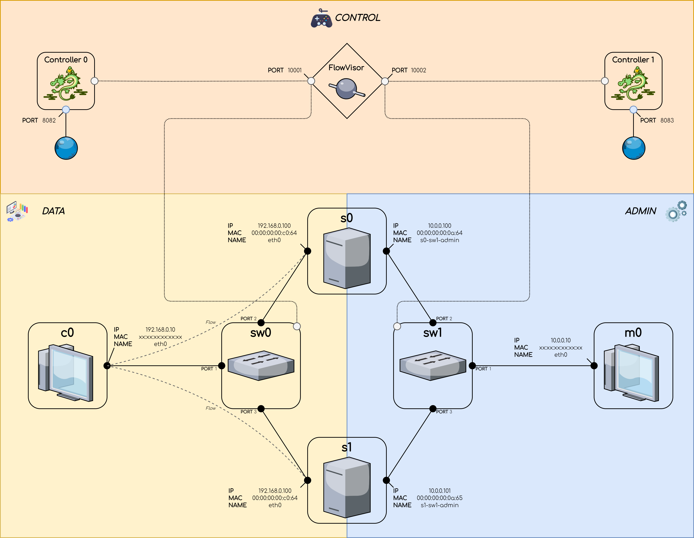

# Softwarized and Virtualized Mobile Networks | Morphing Slices

[](https://github.com/nico989/SVMN/actions)
[](https://github.com/pre-commit/pre-commit)

## Members

|  Name  |  Surname  |     Username     |    MAT     |
| :----: | :-------: | :--------------: | :--------: |
| Carlo  | Corradini | `carlocorradini` | **223811** |
| Nicolò |   Vinci   |    `nico989`     | **220229** |
| Mattia | Perpenti  |    `MrPerpe`     | **229371** |

## Getting Started

These instructions will get you a copy of the project up and running on your
local machine for development and testing purposes.

### Clone

```bash
git clone --recursive https://github.com/nico989/SVMN.git
cd SVMN
```

### Permissions

```bash
chmod -R +x scripts
```

### Initialize

#### Linux

Run the initialization script:

```bash
scripts/init.sh
```

#### Windows

`Windows` users must install [`WSL` (Windows Subsystem for Linux)](https://docs.microsoft.com/windows/wsl/install).\
To correctly configure the project in `WSL` you must follow these steps:

> Configuration must be done in `WSL` and not in `Windows`.

1. Install [`Vagrant`](https://www.vagrantup.com/downloads) in `WSL`.\
   Note that you must also have installed `Vagrant` in `Windows`.
1. Configure `Vagrant` to run in `WSL` following the official guide
   [_Vagrant and Windows Subsystem for Linux_](https://www.vagrantup.com/docs/other/wsl).
1. Install [`virtualbox_WSL2`](https://github.com/Karandash8/virtualbox_WSL2)
   `Vagrant` plugin in `WSL`:

   ```bash
   vagrant plugin install virtualbox_WSL2
   ```

1. Replace line _565_ of `platform.rb` file located at
   `/opt/vagrant/embedded/gems/[VAGRANT_VERSION]/gems/vagrant-[VAGRANT_VERSION]/lib/vagrant/util/platform.rb`
   from:

   ```ruby
   if info && (info[:type] == "drvfs" || info[:type] == "9p")
   ```

   To

   ```ruby
   if info && (info[:type] == "drvfs" || info[:type] == "9p" || info[:type] == "ext4")
   ```

   See [this issue](https://github.com/hashicorp/vagrant/issues/11623) for more information.

1. Run the initialization script:

   ```bash
   scripts/init.sh
   ```

## Development

> Prepare `comnetsemu` and keeps updated working directory

```bash
scripts/dev.sh
```

### Distribution

Generate `morphing_slices.tar.gz`:

```bash
scripts/prod.sh
```

## Production

### Installation

> All commands must be executed inside `comnetsemu`

1. Download `morphing_slices.tar.gz` from GitHub release:

   ```bash
   wget https://github.com/nico989/SVMN/releases/latest/download/morphing_slices.tar.gz
   ```

1. Create `morphing_slices` directory:

   ```bash
   mkdir morphing_slices
   ```

1. Extract `morphing_slices.tar.gz` into `morphing_slices` directory:

   ```bash
   tar -xzf morphing_slices.tar.gz -D morphing_slices
   ```

1. Change working directory to `morphing_slices`:

   ```bash
   cd morphing_slices
   ```

1. Scripts permissions:

   ```bash
   chmod -R +x scripts
   ```

1. Initialize:

   ```bash
   sudo scripts/init.sh
   ```

## Clean

Ensure to clean old works in `comnetsemu`.

> All commands must be executed inside `comnetsemu`

```bash
scripts/clean.sh
```

## Abstract

The project implements a stateful and transparent migration service.
In the following scenarios there are two servers which implement the same Flask
application. Only one of them is active and the other is unavailable.
The active one increments a counter each time a user performs
an HTTP post request to the API _/api/counter_.
The migration is stateful, because the active server
passes the counter to the disabled server when it becomes available.
So, the counter value is kept during the migration.
The manager m0 is in charge of disabling the active server and enabling
the new one by passing the counter value to it.
Moreover, the migration is transparent from the client c0 point of view,
because the two servers have the same IP and MAC address.
It is enough to update the flow to redirect the client to the new active server.
Hence, the client c0 is not aware whether it is making an HTTP request
to the server s0 or s1.

## Scenario 1



In the scenario 1, the migration is handled by FlowVisor and the controller 0
which manages the switch sw0 in the data side. Instead, the controller 1
manages the switch sw1 in the admin side.
After a user input, the manager m0 migrates the active server and FlowVisor
redirects the client c0 to the new available server creating a new flow.

### Terminal 1

1. Create network topology:

   ```bash
   sudo python3 topology.py --file scenarios/1/topology.yaml
   ```

1. Wait `Terminal 2.2`.

1. Wait `Terminal 3.1`

1. Increment the counter:

   > Make as many requests as you want

   ```bash
   c0 curl -X POST 192.168.0.100/api/counter
   ```

### Terminal 2

1. Start FlowVisor container:

   ```bash
   scripts/flowvisor.sh --volume scenarios/1
   ```

1. Run FlowVisor:

   ```bash
   ./flowvisor.sh
   ```

1. Wait `Terminal 3.1`.

1. Migrate:

   > Make as many migrations as you want

   ```bash
   Press 'Enter' to migrate or 'q' to exit
   ```

### Terminal 3

1. Start Ryu controller(s):

   ```bash
   parallel --ungroup ::: 'scripts/ryu.sh --controller scenarios/1/controller.py --ofport 10001 --port 8082 --config scenarios/1/controller.cfg' 'scripts/ryu.sh --controller scenarios/1/controller.py --ofport 10002 --port 8083'
   ```

1. Open browser at <http://localhost:8082>

1. Open browser at <http://localhost:8083>

## Scenario 2


In the scenario 2, the migration is handled directly by ovs-ofctl which
defines flows for both data and admin.
After a user input, the manager m0 migrates the active server to the new
one and ovs-ofctl redirects the client c0 to the new available server
updating the correspondent flow.

### Terminal 1

1. Create network topology:

   ```bash
   sudo python3 topology.py --file scenarios/2/topology.yaml
   ```

1. Wait `Terminal 2.1`.

1. Increment the counter:

   > Make as many requests as you want

   ```bash
   c0 curl -X POST 192.168.0.100/api/counter
   ```

### Terminal 2

1. Run OpenFlow:

   ```bash
   scenarios/2/openflow.sh
   ```

1. Migrate:

   > Make as many migrations as you want

   ```bash
   Press 'Enter' to migrate or 'q' to exit
   ```

## License

This project is licensed under the MIT License.
See [LICENSE](LICENSE) file for details.
